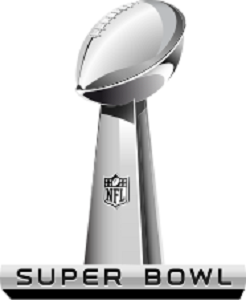

# Entertainment Evolves Over Time...
## Kurtis Haut
## In Class Exercize 5
## Feb 05, 2018

### Summary
This docment serves to explore the how entertainment has evolved over time by looking at three forms of entertainment throughout history. 
We will explore three forms of entertainment, that may at first seems unrelated, however, after reading this file, it is our hope that you will see the similiarities and how we have come up with what we currently watch as entertainment! 
We start off in the age of the Ancient Greeks and see how they competed in the olympics. We then fast forward to the height of the Roman Empire where the Colosseum was used to entertain the masses. We then conclude with the modern day Super Bowl and look at how it is really a combination of both of those events.

### Greek Olympics
The ancient Olympic Games were originally a festival, or celebration of and for Zeus; later, events such as a footrace, a javelin contest, and wrestling matches were added. The Olympic Games were a series of athletic competitions among representatives of city-states and one of the Panhellenic Games of ancient Greece. 

### Roman Colosseum 
The Colosseum could hold, it is estimated, between 50,000 and 80,000 spectators,[5][6] having an average audience of some 65,000;[7][8] it was used for gladiatorial contests and public spectacles such as mock sea battles (for only a short time as the hypogeum was soon filled in with mechanisms to support the other activities), animal hunts, executions, re-enactments of famous battles, and dramas based on Classical mythology. 

### Super Bowl
The Super Bowl is in fact a combination of the Olympics and Colosseum. All the city-states aka NFL football teams compete to win the championship. It is also hosted in a large dome that oddly resembles the Colosseum! 

### Conclusion 
- As humans, we have been looking for entertainment our whole lives
- We love to compete with one another to get this entertainment
- We not only love competing against one another, but we also enjoy watching others compete
- The Greek Olympics is where we first start to see this competition at a large scale, where people are representing a society larger than themselves
  - This is similar to how NFL Football teams represent the city that they play in!
- The Colosseum is where we start to see the masses gathering to watch entertainment (often a competition of some sort)
  - This is exactly like football statdiums !

